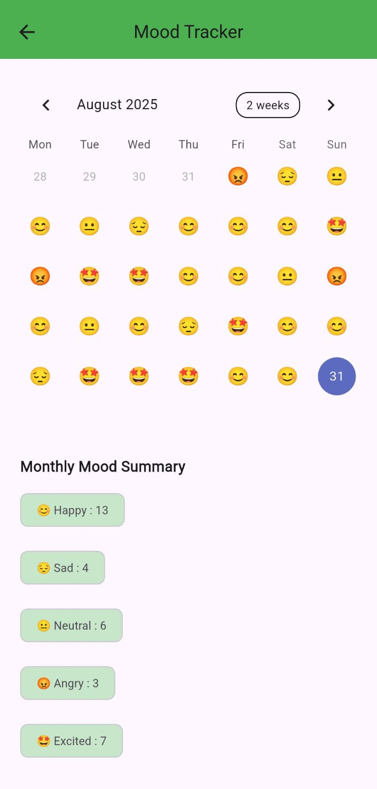
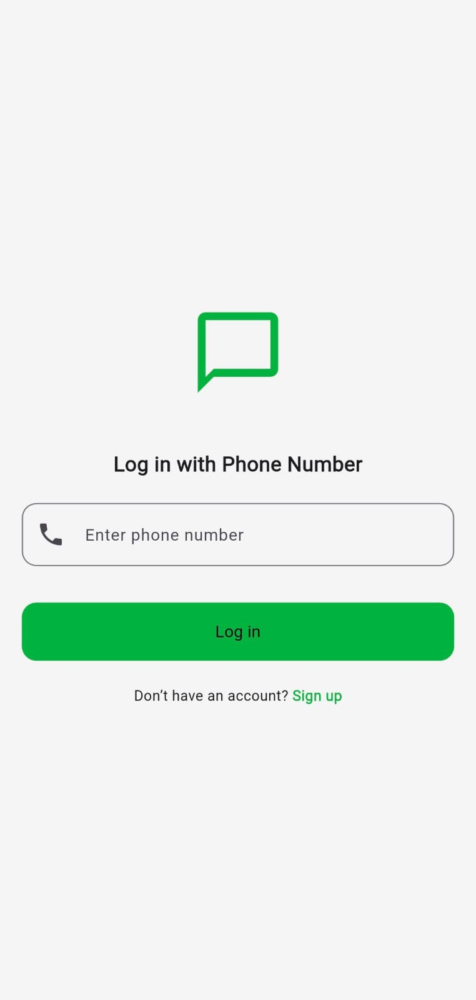

# 🩺 Health Check-In App  

A simple and intuitive **Flutter-based health check-in application** designed to help users track their moods, wellness, and overall daily health status.  

---

## 👨‍💻 Author  
**Yash Grover**  
- 🎓 B.Tech CSE (3CSE14)  
- 🆔 Roll No: CS-23411108  
- 💡 Passionate about building mobile apps, exploring Flutter, Firebase, and modern development tools.  

---

## 🚀 Features  
- 📲 OTP Verification Login
- 📅 Daily health and mood check-in  
- 📊 Track wellness trends  
- 🖥️ Clean UI built with Flutter  
- ⚡ Fast, responsive, and user-friendly  

---

## 🛠️ Tech Stack  
- **Framework:** Flutter  
- **Language:** Dart  
- **IDE:** Android Studio 

---

## 📥 Installation  

1. Clone the repository:  
   git clone https://github.com/yashgrover25/health_checkin_app.git

2. Navigate to the project directory:
   cd health_checkin_app
   
3. Get dependencies:

   flutter pub get

  
4. Run the app:

   flutter run

---

| Home Screen | Calendar View | Get Started Screen | Login  Screen |
|-------------|---------------|--------------|--------------|
|  |  |  |  |


## 📬 Contact

* GitHub: [@yashgrover25](https://github.com/yashgrover25)
* Email: yash.grover.cs27@iilm.edu , ygrover178@gmail.com
* LinkedIn: https://www.linkedin.com/in/yash-grover17/

---

⭐ If you like this project, don’t forget to **star the repository**!

```
